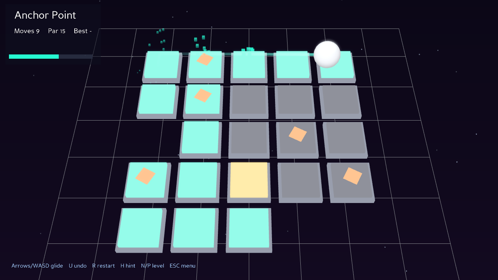

# GLIDE

A minimalist **sliding puzzle** built in **Python** with the **Panda3D** engine.
Not a classic type — an original mechanic from three tiny rules:

1. You **can't stop** — pick a direction and you slide until you hit a wall, the
   board edge, or your own trail.
2. Every tile you cross **lights up**, and your **lit trail becomes a wall**.
3. **Light up every tile** in one continuous journey to win.

Amber **stop-tiles** halt a slide so you can control it. That's the whole game —
and it produces surprisingly deep puzzles. Unlimited **undo** and a **hint**
button keep it fair, never frustrating.



```
python -m pip install -r requirements.txt
python run.py
```

> Requires Python 3.8+ and a GPU with OpenGL. Tested on Windows 11 with
> Python 3.12 and Panda3D 1.10.

---

## Controls

| Key | Action |
| --- | --- |
| Arrow keys / `WASD` | Glide in a direction |
| `U` | Undo (unlimited) |
| `R` | Restart the level |
| `H` | Hint — the solver tells you the next optimal move |
| `N` / `P` | Next / previous level |
| `1`–`6` | Jump to a level |
| `Enter` | Start / advance · `Esc` menu |

## The solver is the centrepiece

Slide-to-fill levels are easy to make *unsolvable* by accident, so GLIDE ships
with a real solver — a breadth-first search over `(position, filled-set)` states
in [`solver.py`](glide/solver.py). Because a lit trail is never un-lit, the
filled set only grows, so the state space stays small and BFS returns the
**shortest** solution fast. That one component does three jobs:

- **Guarantees solvability.** Every shipped level is verified by the solver — the
  headless test below refuses to pass otherwise.
- **Powers the hint button** (`H`) from *any* position you've reached.
- **Computes each level's par** (the optimal move count you're scored against).

### Levels are generated, not hand-placed

The levels were produced by a generator that runs a random sequence of legal
slides on a full board, then turns every never-visited cell into a wall. Because
a slide only ever stops at the trail or an edge, walling off the unvisited cells
**cannot change any executed slide** — so the recorded run is guaranteed to still
solve the resulting level. Each generated board is then re-checked with the
independent BFS solver and tagged with its par. (Generator in `tools/`; the six
shipped levels are the solver-vetted output.)

## Project structure

```
glide/
├── run.py                # entry point + CLI (--smoke / --shot / --debug)
├── requirements.txt
├── levels/               # six solver-verified levels (JSON ASCII grids + par)
└── glide/
    ├── app.py            # ShowBase app, state machine, input, slide animation
    ├── level.py          # grid model + the pure slide/fill rules
    ├── solver.py         # BFS solver: verify, hint, par
    ├── board.py          # tiles, orb, fill animation, pop effects, camera
    ├── hud.py            # HUD + menu / win / stuck overlays
    ├── geometry.py       # procedural meshes (box, sphere) — no external assets
    └── settings.py       # every tuning constant in one place
```

## Design decisions

- **The rules live in one pure function.** [`slide()`](glide/level.py) has no
  engine dependency, so the *game* and the *solver* share exactly the same logic
  — the hint can never disagree with what actually happens on screen.
- **Logic and animation are separate.** A move updates the logic state instantly;
  the orb animation is pure presentation that lights tiles as it passes. That
  keeps the game deterministic and the solver honest.
- **Neon presentation, kept cheap.** Tiles are unlit coloured quads on darker
  base plates (crisp borders, no per-tile lighting cost); only the orb is lit.
  A post-process **bloom** filter makes the orb, trail, and filled tiles glow,
  over a gradient + starfield backdrop and a perspective grid floor.
- **Levels are data.** ASCII grids in JSON — trivial to author, diff, and verify.
- **Fair by design.** Unlimited undo + a solver-backed hint mean a player is
  never stuck without a way forward.

## Level format

```json
{ "name": "Anchor Point", "par": 15,
  "grid": [".s...", ".s...", "#..s.", "s.o.s", "...##"] }
```

`o` start · `.` fillable · `s` stop-tile · `#` wall/gap. Add a file to `levels/`
and it appears in the menu.

## Testing

```
python run.py --smoke     # loads level 1, SOLVES it via the solver, asserts a win
python run.py --shot      # render a screenshot offscreen and exit
```

The smoke test is a genuine end-to-end run: it drives the real game with the
solver's moves and exits non-zero if the win state isn't reached.

## License

MIT — see [LICENSE](LICENSE).
